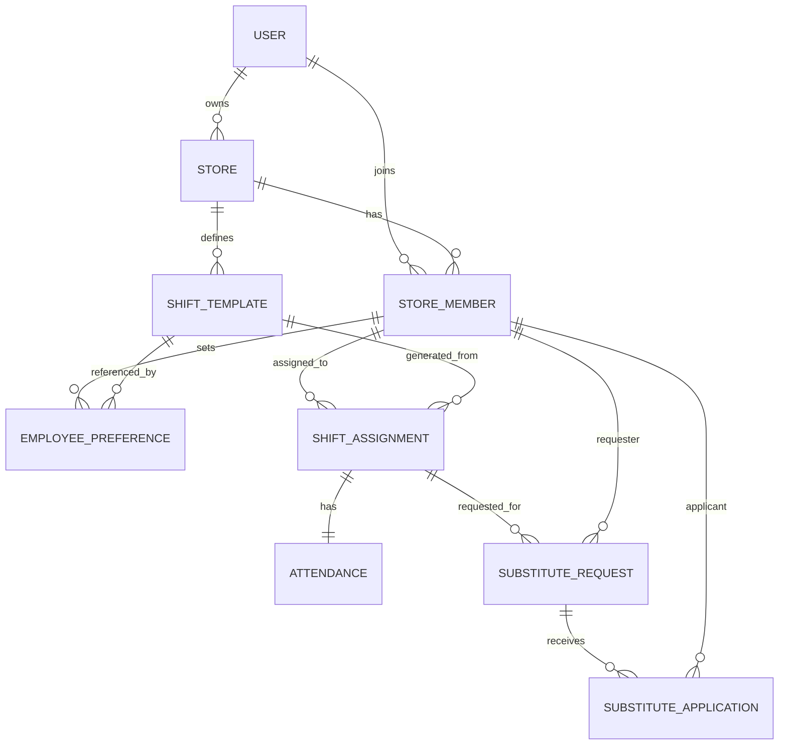

# ShiftMate Backend

ShiftMate Backend는 매장 단위 근무 운영을 위한 API 서버입니다.  
인증, 매장/멤버 관리, 근무 템플릿, 자동 스케줄 생성, 출퇴근, 대타 관리, 월급 집계를 제공합니다.

## 1. 프로젝트 개요

- 목적: 매장 운영자가 근무표를 쉽게 만들고, 직원이 출퇴근/대타/급여 정보를 확인할 수 있는 백엔드 제공
- 아키텍처: 도메인 중심 패키지 + Controller/Service/Repository 계층 구조
- 공통 응답 포맷: `ApiResponse<...>` 래퍼로 성공/실패 구조 통일

## 2. 기술 스택

### Language


### Framework / Web


### Persistence


### Auth


### Cache / Token Store


### Mail


### Build


### Infra


## 3. 패키지 구조

```text
src/main/java/com/example/shiftmate
├── domain
│   ├── auth                # 회원가입/로그인/토큰/비밀번호 재설정
│   ├── user                # 내 정보/비밀번호 변경/급여 집계
│   ├── store               # 매장 CRUD/사업자번호 검증
│   ├── storeMember         # 매장 멤버 관리(초대/수정/삭제/조회)
│   ├── shiftTemplate       # 근무 템플릿 생성/타입 관리
│   ├── employeePreference  # 직원 선호도 관리
│   ├── shiftAssignment     # 주간 자동 스케줄 생성/조회/삭제
│   ├── attendance          # 출퇴근 처리/근태 조회
│   └── substitute          # 대타 요청/지원/승인/취소
└── global
    ├── config              # Security, RestTemplate 설정
    ├── security            # JWT Provider/Filter/UserDetails
    ├── exception           # 공통 예외 처리
    └── common              # 공통 DTO/엔티티(BaseTimeEntity)
```

## 4. 핵심 도메인 모델



## 5. 주요 비즈니스 동작

### 5.1 인증/토큰

- `POST /auth/login` 성공 시 Access/Refresh 토큰 발급
- Refresh 토큰은 Redis(`refresh:{email}`)에 저장
- `POST /auth/reissue`에서 토큰 카테고리/Redis 일치 여부 검증 후 재발급
- 비밀번호 재설정은 토큰 생성 후 메일 발송 방식으로 동작
- 만료된 재설정 토큰은 사용할 수 없으며, 10분 주기 스케줄러로 정리

### 5.2 스케줄 자동 생성

- 관리자 권한(매장 멤버 + MANAGER) 검증
- 시작일은 월요일만 허용
- 동일 주차 중복 생성 방지
- 선호도(`UNAVAILABLE` 제외) 기반으로 시프트 희소성 우선 배정

### 5.3 출퇴근

- 출퇴근 처리 API는 관리자 권한으로만 실행
- PIN 코드로 대상 근무자 검증
- 출근 가능 시간: 근무 시작 30분 전 ~ 근무 종료 시각
- 퇴근 가능 시간: 근무 시작 ~ 근무 종료 + 4시간
- 출근 후 5분 이내 퇴근 시도는 차단

### 5.4 대타

- 요청자는 본인 스케줄에만 요청 가능
- 근무 시작 24시간 이내 요청 불가
- 지원자는 같은 부서 + 시간 충돌 없는 경우만 지원 가능
- 관리자 승인 시 요청 상태는 `APPROVED`, 선택 지원자는 `SELECTED`, 나머지 지원자는 `REJECTED`로 변경
- 승인 완료 시 실제 `ShiftAssignment` 담당자가 지원자로 교체

### 5.5 월급 집계

- 완료 근무(출근/퇴근 모두 존재)만 집계
- 지각 시 급여 시작 시각 보정
- 분 단위 근무 시간을 매장별로 합산해 예상 급여 계산

## 6. API 개요

### Auth

- `POST /auth/signup`
- `POST /auth/login`
- `POST /auth/reissue`
- `POST /auth/logout`
- `POST /auth/password-reset/request`
- `POST /auth/password-reset/confirm`

### User

- `GET /users/admin/user-info?email=`
- `GET /users/me`
- `GET /users/me/salary/months`
- `GET /users/me/salary/monthly?year=&month=`
- `PATCH /users/me/password`
- `PATCH /users/me`

### Store

- `POST /stores`
- `GET /stores`
- `GET /stores/{storeId}`
- `PUT /stores/{storeId}`
- `DELETE /stores/{storeId}`
- `POST /stores/verify-bizno`

### Store Member

- `POST /stores/{storeId}/store-members/{userId}`
- `GET /stores/{storeId}/store-members`
- `GET /stores/{storeId}/store-members/{id}`
- `PUT /stores/{storeId}/store-members/{id}`
- `DELETE /stores/{storeId}/store-members/{id}`

### Shift Template / Preference / Assignment

- `POST /stores/{storeId}/shift-template`
- `GET /stores/{storeId}/shift-template`
- `GET /stores/{storeId}/shift-template/type`
- `PUT /stores/{storeId}/shift-template`
- `PUT /stores/{storeId}/shift-template/{templateId}`
- `DELETE /stores/{storeId}/shift-template`
- `DELETE /stores/{storeId}/shift-template/type`
- `POST /stores/{storeId}/members/{memberId}/preferences`
- `GET /stores/{storeId}/members/{memberId}/preferences`
- `PUT /stores/{storeId}/members/{memberId}/preferences/{preferenceId}`
- `DELETE /stores/{storeId}/members/{memberId}/preferences`
- `POST /stores/{storeId}/schedules/auto-generate`
- `GET /stores/{storeId}/schedules?weekStartDate=`
- `GET /stores/{storeId}/schedules/me`
- `DELETE /stores/{storeId}/schedules?weekStartDate=`

### Attendance

- `POST /stores/{storeId}/attendance/clock`
- `GET /stores/{storeId}/attendance/daily?date=`
- `GET /stores/{storeId}/attendance/weekly?date=`
- `GET /stores/{storeId}/attendance/weekly/my?date=`

### Substitute

- `POST /stores/{storeId}/substitute-requests`
- `GET /stores/{storeId}/substitute-requests/others`
- `GET /stores/{storeId}/substitute-requests/my`
- `GET /stores/{storeId}/substitute-requests/all`
- `DELETE /stores/{storeId}/substitute-requests/{requestId}`
- `POST /stores/{storeId}/substitute-requests/{requestId}/apply`
- `GET /stores/{storeId}/substitute-requests/applications/my`
- `DELETE /stores/{storeId}/substitute-requests/applications/{applicationId}`
- `GET /stores/{storeId}/substitute-requests/{requestId}/applications`
- `PATCH /stores/{storeId}/substitute-requests/{requestId}/applications/{applicationId}/approve`
- `PATCH /stores/{storeId}/substitute-requests/{requestId}/applications/{applicationId}/reject`
- `DELETE /stores/{storeId}/substitute-requests/{requestId}/manager-cancel`

## 7. 공통 응답 포맷

성공:

```json
{
  "success": true,
  "data": {},
  "error": null
}
```

실패:

```json
{
  "success": false,
  "data": null,
  "error": {
    "code": "ERROR_CODE",
    "message": "오류 메시지",
    "details": []
  }
}
```

## 8. 실행 가이드

### 8.1 사전 준비

- JDK 21
- MySQL
- Redis

### 8.2 환경 변수

`application.properties`는 루트의 `.env`를 import 합니다.

주요 변수:

- `JWT_SECRET`
- `JWT_ACCESS_EXPIRATION`
- `JWT_REFRESH_EXPIRATION`
- `SPRING_DATASOURCE_URL`
- `SPRING_DATASOURCE_USERNAME`
- `SPRING_DATASOURCE_PASSWORD`
- `SPRING_DATASOURCE_DRIVER_CLASS_NAME`
- `REDIS_HOST`
- `REDIS_PORT`
- `REDIS_TIMEOUT`
- `BIZNO_API_KEY`
- `MAIL_HOST`, `MAIL_PORT`, `MAIL_USERNAME`, `MAIL_PASSWORD`
- `MAIL_FROM`
- `FRONTEND_BASE_URL`

### 8.3 로컬 실행

```bash
./gradlew bootRun
```

기본 포트: `8080`

### 8.4 테스트

```bash
./gradlew test
```

현재 테스트는 스모크 테스트(`contextLoads`) 위주입니다.

### 8.5 Docker

```bash
docker build -t shiftmate-back .
docker run -p 8080:8080 --env-file .env shiftmate-back
```

## 9. 데이터 초기화 및 운영 시 주의사항

- 현재 기본 설정은 `spring.jpa.hibernate.ddl-auto=create`, `spring.sql.init.mode=always`, `spring.jpa.defer-datasource-initialization=true` 입니다.
- 애플리케이션 시작 시 스키마가 재생성되고 `data.sql`이 실행됩니다.
- 운영 환경에서는 반드시 DDL 정책(`update`/`validate` 등)과 초기화 정책을 분리해야 합니다.

## 10. 보안 관련 참고

- JWT 필터는 Access 토큰을 파싱해 SecurityContext를 구성합니다.
- 현재 `SecurityConfig`의 URL 인가 규칙은 `anyRequest().permitAll()` 상태입니다.
- 실제 운영에서는 엔드포인트별 인증 강제 규칙으로 조정이 필요합니다.
- 현재 다수 권한 검증은 URL 보안 설정이 아닌 서비스 레이어에서 수행됩니다.

## 11. 배포

- GitHub Actions 워크플로우: `.github/workflows/deploy.yml`
- `main` 브랜치 push 시 Docker 이미지 빌드/푸시 후 원격 서버에서 `docker-compose`로 백엔드 재기동
